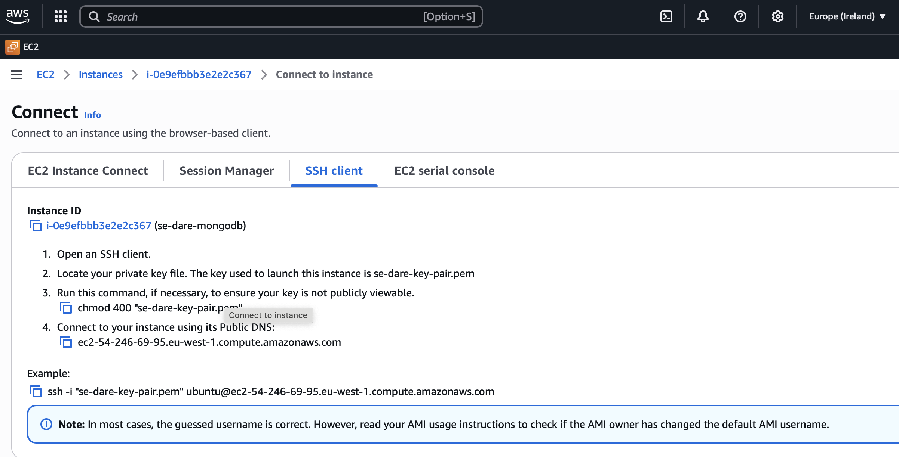
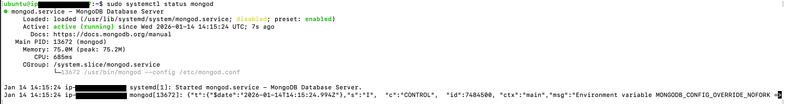

# Deploying MondgoDB to an EC2 Instance

## Create New Instance (AWS EC2)

| Details | Inputs |
|:----------------|:--------|
|Names and tags| se-dare-mongodb|
| AMI | Ubuntu 24.04|
| Instance Type | t3.micro|
| Key Pair | se-name-key-pair.pem|
| Network Settings |
| - Security Group Name | se-name-sg|
| - Description | se-name-sg created at YYYY-MM-DD-HH-MM-SS|
| - Securtiy Group Rule 1 |  Type: TCP &#124;  Source: 0.0.0.0/0 &#124; Port Range: 22 |
| - Securtiy Group Rule 2 |  Type: Custom TCP &#124;  Source: 0.0.0.0/0 &#124; Port Range: 27017 |
|Configure Storage | 1x8GiB pg3 root volume |


## Connecting to EC2 via SSH
1. In your terminal (or GitBash), navigate to your `.ssh` folder. This folder should store your private key file. ie. key-pair.pem.
    ```
    cd .ssh
    ```

2. Ensure that your private key is readable

    ```
    chmod 400 key-pair.pem
    ```

3. Connect to your instance using the following command:

    ```
    ssh -i "se-dare-key-pair.pem" ubuntu@<your-ec2-public-dns>.eu-west-1.compute.amazonaws.com
    ```




## Installing to MongoDB
1. Enter .ssh directory
    ```
    cd .ssh
    ```

2. Connect to your instance using the following command:
    ```
    ssh -i "se-dare-key-pair.pem" ubuntu@<your-ec2-public-dns>.eu-west-1.compute.amazonaws.com
    ```

3. Update Ubuntu
    ```
    sudo apt update -y
    ```

4. Upgrade
    ```
    sudo apt upgrade -y
    ```

5. Install something
    ```
    sudo apt install gnupg curl -y
    ```

6. Install MongoDB application 
    ```
      curl -fsSL https://www.mongodb.org/static/pgp/server-7.0.asc | \
        sudo gpg -o /usr/share/keyrings/mongodb-server-7.0.gpg \
        --dearmor
    ```
7. echo something
    ```
    echo "deb [ arch=amd64,arm64 signed-by=/usr/share/keyrings/mongodb-server-7.0.gpg ] https://repo.mongodb.org/apt/ubuntu jammy/mongodb-org/7.0 multiverse" | sudo tee /etc/apt/sources.list.d/mongodb-org-7.0.list
    ```
8. Update for new installation
    ```
    sudo apt update
    ```
9. Install mongoDB again?
    ```
    sudo apt install -y mongodb-org=7.0.6 mongodb-org-database=7.0.6 mongodb-org-server=7.0.6 mongodb-mongosh=2.1.5 mongodb-org-mongos=7.0.6 mongodb-org-tools=7.0.6
    ```
10. Confirm MongoDB version
    ```
    mongod --version
    ```
> You can check with `mongod -v` but that provides a robust output of info

## Start MongoDB
1. cd to directory with mongo configuration file
    ```
    cd /etc/
    ```

2. Open the Mongo configuration file
    ```
    sudo nano mongog.conf
    ```
3. Edit and save the the file
    ```
    xx > 0.0.0.0
4. Start MongoDB
    ```
    sudo systemctl start mongod
    ```
5. Confirm status of MongoDB
    ```
    sudo systemctl status mongod
    ```
6. If your `Active` state is showing as <mark>failed</mark>, then run the following commands
    
    i. find out what this is
      ```
      sudo chown -R mongodb:mongodb /var/lib/mongodb
      ```
    ii. find out what this does
      ```
      sudo chown mongodb:mongodb /tmp/mongodb-27017.sock
      ```
    iii. Restart MongoDB
      ```
      sudo service mongod restart
      ```
    iv. Check status of MongoDB
      ```
      systemctl status mongod
      ```


