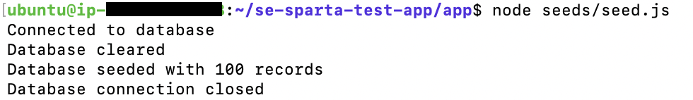
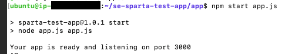

# Deploy an Application to MongoDB

## Create New Instance (AWS EC2)

| Details | Inputs |
|:----------------|:--------|
| Names and tags | se-dare-deploy-app|
| AMI | Ubuntu 24.04|
| Instance Type | t3.micro|
| Key Pair | se-name-key-pair.pem|
| Network Settings |
| - Security Group Name | se-name-sg|
| - Description | se-name-sg created at YYYY-MM-DD-HH-MM-SS|
| - Securtiy Group Rule 1 |  Type: SSH &#124;  Source: 0.0.0.0/0 &#124; Port Range: 22 |
| - Securtiy Group Rule 2 |  Type: HTTP &#124;  Source: 0.0.0.0/0 &#124; Port Range: 80 |
| - Securtiy Group Rule 3 |  Type: Custom TCP &#124;  Source: 0.0.0.0/0 &#124; Port Range: 3000 |
|Configure Storage | 1x8GiB pg3 root volume |


## Connecting to EC2 via SSH
1. In your terminal (or GitBash), navigate to your `.ssh` folder. This folder should store your private key file. ie. key-pair.pem.

2. Ensure that your private key is readable

    ```
    chmod 400 key-pair.pem
    ```

3. Connect to your instance using the following command:

    ```
    ssh -i "se-dare-key-pair.pem" ubuntu@<your-ec2-public-dns>.eu-west-1.compute.amazonaws.com
    ```


## Copy your bash script to your Instance
1. Navigate to the location of your bash script

2. Copy the script to your ubuntu image.
    ```
    scp -i ~/.ssh/se-dare-key-pair.pem ./app-deploy.sh ubuntu@<your-ec2-public-dns>:~
    ```
3. Input `yes` to add the IP address to your list of known hosts.

## Run the script on your Instance
1. Navigate to your terminal with the running Instance

2. Provide access to the bash script.
    ```
    sudo chmod +x app-deploy.sh
    ```
3. Run your bash script. this file will action the following

    - Clone the app from GitHub
    - Install nginx and curl
    - Download and install NodeJS 
    - Install npm and pm2
    - Kill all node processes
    - Start the app.js

    ```
    ./app-deploy.sh
    ```
4. Create the variable for the MongoDB connection string

    The Database IP Address (DB-IP-ADDRESS) is normally onfigured to a singular IP address to ensure that the frontend only has access. However, this exercise utilises a public IP for learning purposes. 

    ```
    export DB_HOST=mongodb://<DB-ID-ADDRESS>:27017/posts
    ```
5. Check it has correctly executed
    ```
    echo $DB_HOST
    ```
6. Seed the seed (correct the lingo)
    ```
    node se-sparta-test-app/app/seeds/seed.js
    ```


7. Start the application
    ```
    npm start se-sparta-test-app/app/app.js
    ```


8. The seed.js includes a random words generator. So you can stop the application, re-seed and start the application to generate a new output.

9. If an error is raised `Error: listen EADDRINUSE: address already in use :::3000`, run the command `pm2 kill`. This will kill an active applications. Reseed and start the app.

