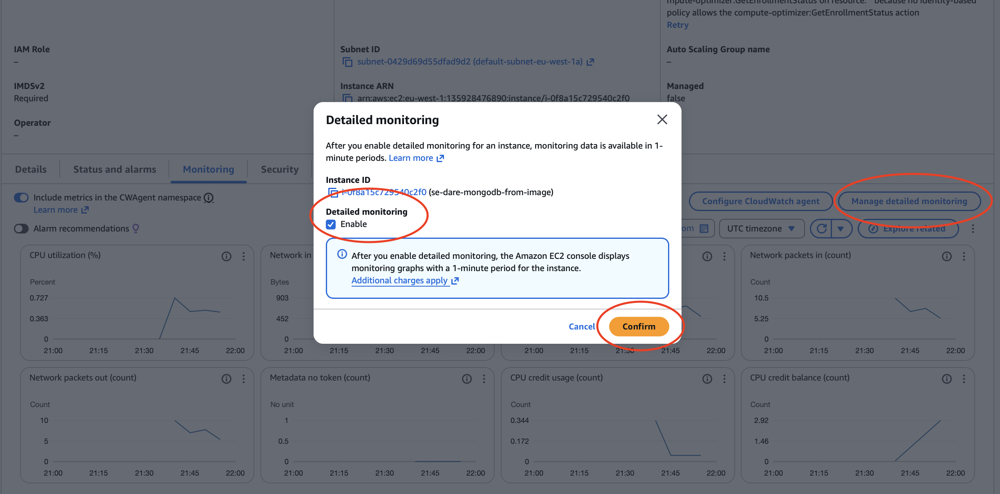
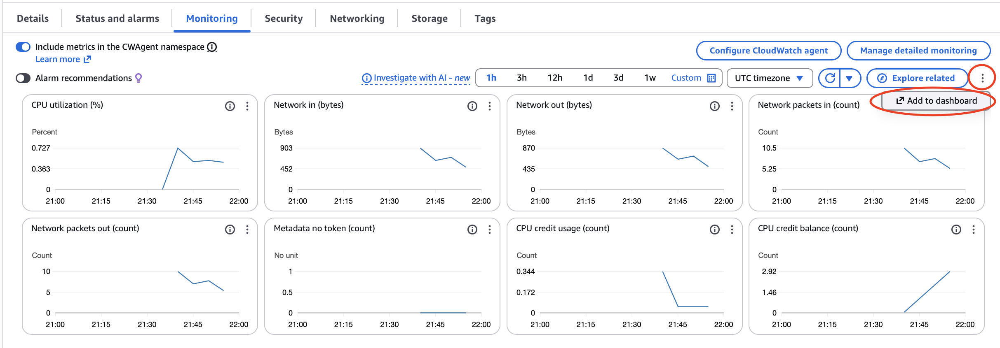
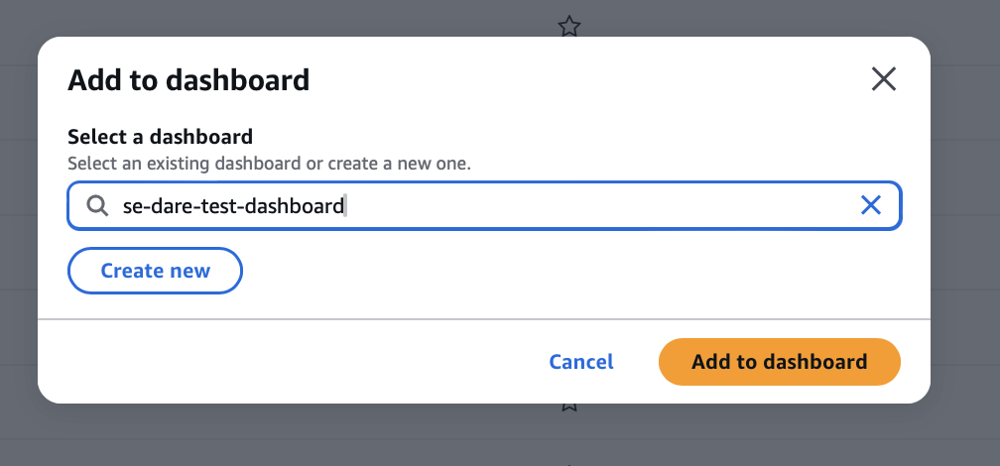
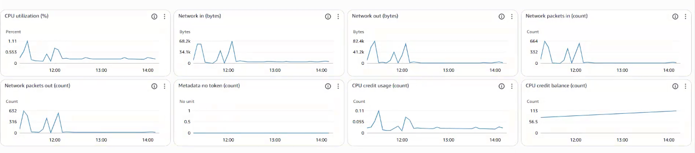
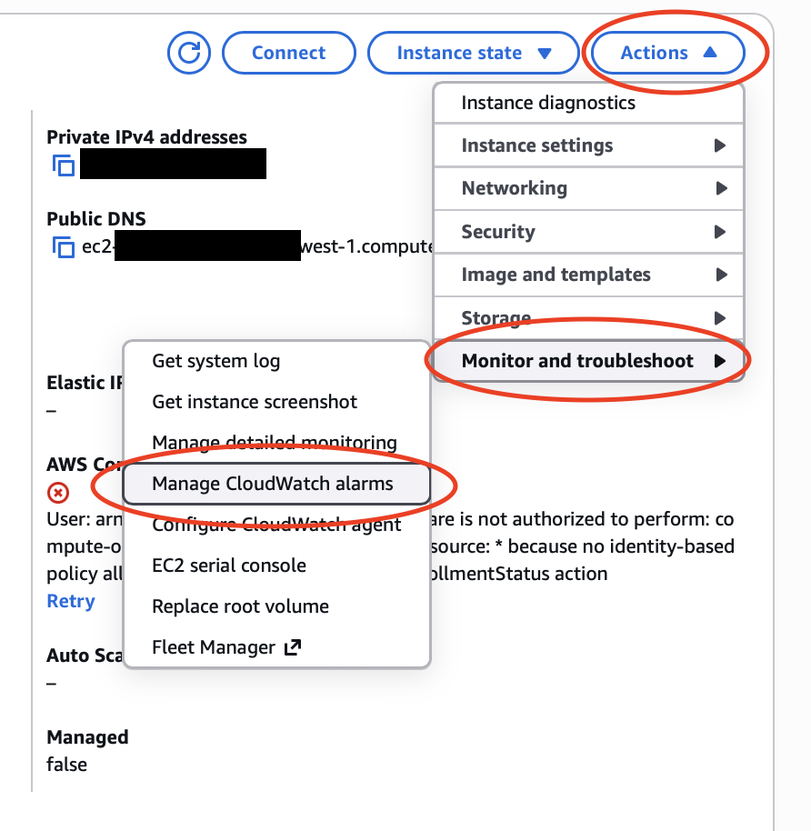

# CHALLENGE - AWS CloudWatch Monitoring and Alert Management

Amazon CloudWatch is a monitoring and observability service in AWS that helps you track the performance, health, and usage of your AWS resources and applications.
# watch recording
2.18.07

### Task 1 - Document how you setup a dashboard.
1. On your instance, enable `detailed monitoring`.

2. Select `add to dashboard`

3. Create a new dashboard.

4. Dashboard provides real-time visibility. Can review metrics such as CPU and network usage. You can monitor multiple resources in one view.

### Task 2 - Document CPU usage alarm
1. On your EC2 instance, select Actions > Monitor and troubleshoot > Manage CloudWatch alarms

