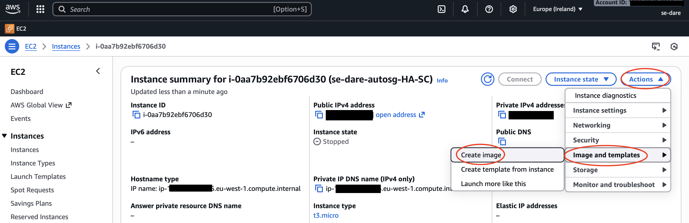
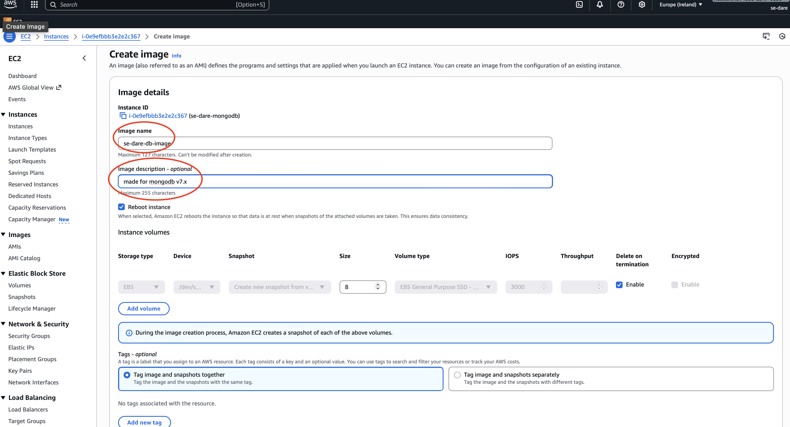
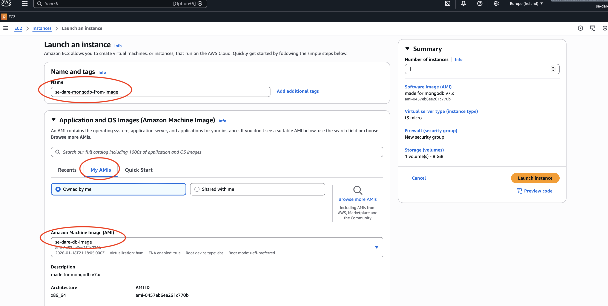
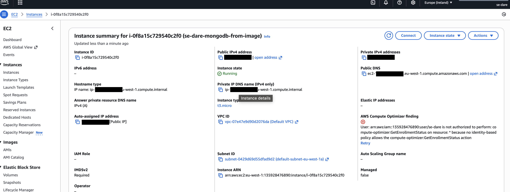

# Creating an Amazong Machine Image (AMI) using the AWS Management Console (GUI)

An Amazon Machine Image (AMI) is a preconfigured template used to launch EC2 instances. It contains the operating system, application software, configurations, and permissions needed to create one or more identical virtual servers in AWS.

1. Select the EC2 instance that you want to create the AMI from. Ensure that the instance has been `stopped`.

2. With the instance selected, click Actions > Images and templates > Create Image

3. Configure the image details (ie. Image name and Image description)
    - Ensure to include a tag to provide the image a name (Name : se-dare-mongodb-image)

 4. Select Create image. AWS will create the AMI in the background.

 5. In the EC2 dashboard, click AMIs (under Images)

 6. Once the status changes from `pending` to `available`, the AMI is ready to use.

 7. Lauch the new EC2 instance from the AMI by select `My AMIs` and searching for your AMI's name.
     - NB. Select the exisiting `key pair` and `security group`
 

 8. Review EC2 instance details are correct.
 

> The public IP will not be the same as it is a new instance. so you will need to update DB_HOST on the app deployment side. Either in the bashrc file or via export.

