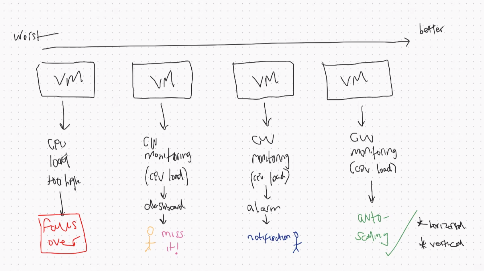

# Monitoring and Reliability
Applications require monitoring and automation to ensure reliability, performance, and availability.

Key monitoring mechanisms include (from worst to best)
1. Failover,
2. dashboards,
3. notifications/alarms, 
4. and autoscaling.



## Failover
Failover monitoring ensures that if a system component (such as a server, database, or availability zone) fails, another healthy component automatically takes over.
### How It Works
- Health checks continuously monitor system components
- When a failure is detected, traffic is rerouted
- Backup resources are promoted to active status
### Purpose
- Minimise downtime
- Ensure high availability
- Protect against hardware or software failure
### Example Use Cases
- Primary database fails and a replica becomes the new primary
- Application server crashes and traffic is redirected to another instance
```pgsql
        ┌────────────┐
        │   Users    │
        └─────┬──────┘
              │
      ┌───────▼────────┐
      │ Load Balancer  │
      └───────┬────────┘
              │
     ┌────────▼─────────┐
     │ Primary Server   │  ❌ Failure
     └────────┬─────────┘
              │
     ┌────────▼─────────┐
     │ Backup Server    │  ✅ Takes Over
     └──────────────────┘
```
NOTE: If there is no monitoring in place, a failover means that the system goes down completely.

## Dashboards
Dashboards provide real-time visual representations of system metrics and performance data, usually in a single view. They allow teams to quickly understand system health at a glance.
### Common Metrics Displayed
 - CPU and memory usage
 - Network traffic
 - Application response time
 - Error rates

### Purpose
 - Centralised visibility of system health
 - Faster troubleshooting
 - Trend analysis over time

### Example Tools
 - Grafana
 - AWS CloudWatch Dashboards
 - Azure Monitor Dashboards

```pgsql
+----------------------------------+
|          Monitoring Dashboard    |
+----------------------------------+
| CPU Usage        |  65%           |
| Memory Usage     |  72%           |
| Requests/sec     |  1,250         |
| Error Rate       |  0.3%          |
| Database Latency |  120ms         |
+----------------------------------+
```

## Notifications / Alarms
Notifications and alarms alert teams when predefined thresholds or abnormal conditions are met. These alerts are triggered automatically based on monitoring data.
Can save costs/spending with rapid response.

### How They Work
 1. Thresholds are defined (e.g. CPU > 80%)
 2. Metrics are continuously monitored
 3. Alerts are sent when thresholds are breached

### Notification Methods
 - Email
 - SMS
 - Push notifications

### Purpose
 - Rapid response to incidents
 - Prevent system outages
 - Reduce mean time to recovery (MTTR)

```css
System Metrics
     │
     ▼
[ CPU > 80% ? ]
     │
     ▼
 Alarm Triggered
     │
     ▼
┌───────────────────────────┐
│ Email / SMS / Slack Alert │
└───────────────────────────┘
```

## Autoscaling
Autoscaling automatically adjusts system resources based on current demand. Resources are increased during high load and reduced during low usage, maintaining performance while controlling costs.

### Types of Autoscaling
 - Horizontal scaling: Adds or removes instances
 - Vertical scaling: Adjusts resource size (CPU/RAM)

### How It Works
 - Monitors metrics such as CPU usage or request count
 - Applies scaling policies when thresholds are reached
 - Automatically provisions or decommissions resources

### Purpose
 - Maintain performance under varying loads
 - Optimise cost
 - Reduce manual intervention

### Example Use Cases
 - Web traffic spikes during peak hours
 - Seasonal or event-driven workloads ie. Amazon Prime / Ticketmaster for Beyonce

```css
        Low Traffic              High Traffic
     ───────────────        ───────────────────

        [1 Instance]   →   [3 Instances]
             │                    │
        CPU 30%              CPU 85%
             │                    │
        Scale Down          Scale Up
```

## Combination
Monitoring mechanisms can work together. Metrics feed into a monitoring system that drives dashboards, triggers alarms, and controls autoscaling actions.

 - Detect failures (Failover)
 - Visualise system health (Dashboards)
 - Alert teams quickly (Notifications/Alarms)
 - Automatically adjust resources (Autoscaling)

```
Metrics Collection
        │
        ▼
Monitoring System
  │      │       │
  ▼      ▼       ▼
Dashboard  Alarm  Autoscaling
            │
            ▼
        Notifications
```


## Summary

| Monitoring Type        | Primary Function                        | Benefit                       |
| ---------------------- | --------------------------------------- | ----------------------------- |
| Failover               | Automatically replace failed components | High availability             |
| Dashboards             | Visualise system metrics                | Fast insights                 |
| Notifications / Alarms | Alert teams to issues                   | Rapid response                |
| Autoscaling            | Adjust resources automatically          | Performance & cost efficiency |

## Sources
 - [Centreon - Observaility](https://www.centreon.com/glossary/observability/)
 - [nOps - AWS EC2 Autoscaling](https://www.nops.io/blog/aws-ec2-autoscaling/)
 - [Amazon Cloudwatch - Dashboards](https://aws.amazon.com/blogs/aws/amazon-cloudwatch-launches-alarms-on-dashboards)
 - [Amazon Cloudwatch - Alarms](https://docs.aws.amazon.com/AmazonCloudWatch/latest/monitoring/AlarmThatSendsEmail.html)
 - [Medium - Amazon Cloudwatch Autoscaling](https://medium.com/@mattiamazzari/auto-scaling-with-cloudwatch-scaling-alarms-using-terraform-dbd83211fd17)
 - [Huawei Cloud - Cloud Eye](https://support.huaweicloud.com/eu/usermanual-rds/rds_mysql_02_0005.html)
